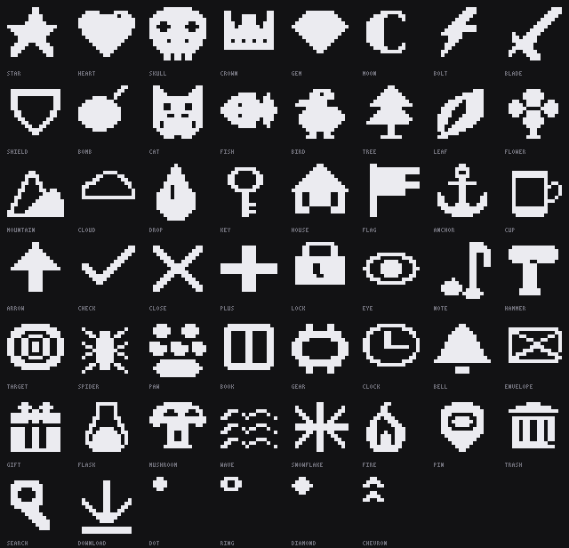

# PatternFront

A 1-bit pattern editor for [OpenFront.io](https://openfront.io) territory patterns — the small
tiling bitmaps that mark out a player's territory. Runs in any browser, from a single file.



Patterns are two colours and at most 129×65 pixels, which sounds trivial and is not: they tile
against absolute world coordinates, so a seam that looks fine in the editor can read as a defect
across a whole territory. PatternFront draws them, previews them tiled at real map scale, and
exports the exact `patternData` string the game takes.

## What it does

- **Draw** — pencil, eraser, fill, line, rectangle, ellipse, symmetry, wrap-around, brush sizes
- **Grab a shape** — 8-connected flood select; drag a heart or a sword around and it backfills behind itself
- **54 stamps** — symbols, animals, nature, objects, UI marks, and small tiles for texture work
- **Layers and frames** — onion skinning, animated GIF export
- **Import an image** — median-cut quantisation to 2 colours with Floyd–Steinberg, Atkinson or Bayer dithering
- **50 duotone presets** — every pair checked for enough luma and hue separation to read at map scale
- **Live tiled preview** — see the seams before the game does
- **Export** — PNG, sprite sheet, animated GIF, and OpenFront `patternData` (or JSON for `cosmetics.json`)

## Run it

```sh
open app/patternfront.html      # macOS
xdg-open app/patternfront.html  # Linux
```

That is the whole thing. One self-contained file — no dependencies, no bundler, no build step and
no network access. Double-click it and it works.

A desktop build for macOS and Windows is [in progress](../../pulls).

Running the checks needs Node 20+ and Python 3.10+:

```sh
./tools/verify-all.sh
```

## How it is put together

```
app/patternfront.html   the entire editor — markup, styles, logic, stamps
tools/                  generators and the verification suite
docs/                   design documents
tests/fixtures/         the codec corpus
```

## Verification

`./tools/verify-all.sh` runs nine suites. They exist because this project kept getting things subtly
wrong in ways that only mechanical checking caught — a seam metric that flagged correct patterns,
a modulo that goes negative in JavaScript but not Python, an unguarded `localStorage` read that
killed the app before first paint in any sandboxed frame.

| Suite | What it proves |
|---|---|
| codec corpus | 1125 patterns across every width 2–129, height 2–65 and all 8 scales round-trip byte-exactly |
| editor codec | the shipping JavaScript agrees with that corpus byte for byte |
| DSL prototype | 28 parametric programs tile without seams, measured not eyeballed |
| map-scale sampling | `sampleAt` matches an independent oracle, including at negative world coordinates |
| UI design rules | no shadows, no gradients, no radius above 2px, no light chrome — the design system, enforced |
| stamp library | every stamp is a valid pattern, uniquely named, and legible at 1× |
| editor behaviour | ~70 assertions running the editor's real functions in a sandbox |
| docs vs OpenFront | *optional* — cross-checks the format docs against a local game checkout |

The last one needs an OpenFront clone and **skips loudly** without one. It never silently passes.

## The pattern format

Documented in [`docs/01-pattern-format.md`](docs/01-pattern-format.md), verified against the real
game data. Briefly: base64url, a 3-byte header carrying scale and dimensions, then LSB-first bits
where **bit 0 is the primary colour**. Maximum 129×65, which is 1403 base64 characters — a number
this repo's corpus hits exactly.

## Status, honestly

The editor is real and works. The AI features described in
[`docs/03`](docs/03-ai-integration.md), [`04`](docs/04-image-to-pattern.md) and
[`07`](docs/07-cost-and-abuse.md) — text-to-pattern, AI region editing, hosted credits — are
**designed and not built**. The image importer in the app today is ordinary quantisation and
dithering, which is deterministic, offline and needs no API key. Those documents are a plan, not
a description.

## Licence

MIT — see [LICENSE](LICENSE).

This project deliberately ships **no OpenFront assets**. Their `cosmetics.json` patterns are
CC BY-SA 4.0 and include third-party characters they cannot sublicense onward, so none of them
are redistributed here. If you have a local OpenFront checkout you can generate them for your own
use in one command. See [NOTICE](NOTICE).

PatternFront is an independent tool. It is not affiliated with or endorsed by OpenFront LLC.
